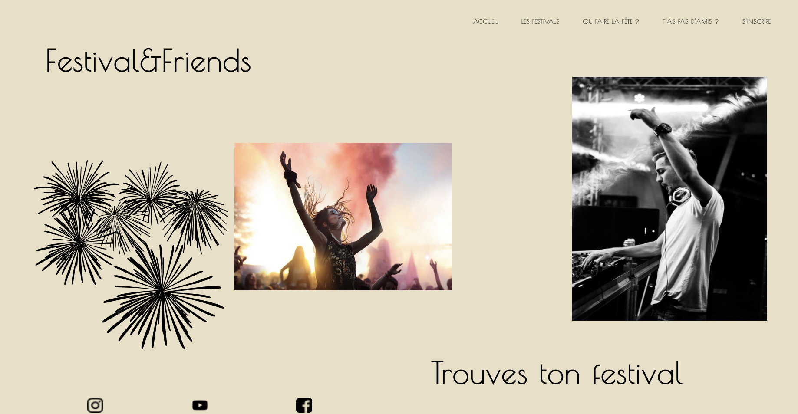
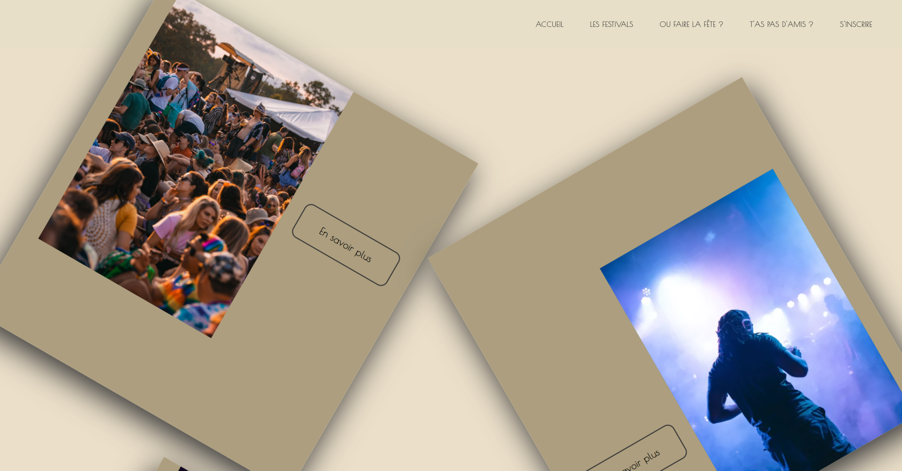

# festival_App

First 24-hour hackathon on the theme of music in the Wild Code School in a group of 6 people.


Page with API calls in React Js to find music festivals and friends to go to.


   

**Home Page**


 
   

**Festivals Page**

## Before starting


```
Before starting, install the dependencies:

npm install


To launch the live server :

npm start

```

